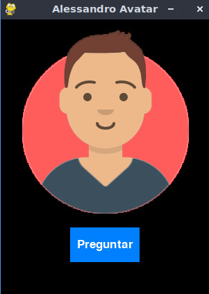

# Alessandro

Integrantes:

- Arteaga Sabja, Juan Armando.
- Bellido Santa María, José Boris.
- Poleyn Paz, Herwig Luk.

Se han desarrollado las siguientes clases:

- **Clase service:** Permite cargar las credenciales del servicio desde el archivo de configuración. 

- **Clase SpeechService:** Es una subclase de de la clase service, que permite encapsular el servicio speech de cognitiveservices de Azure. Contiene dos métodos:
listen: Permite acceder al micrófono y capturar lo que dice el usuario, devolviendo un texto que contiene lo dicho por el usuario.
talk: Permite presentar de manera auditiva un texto.

- **Clase ContentService:** Crea una clase ContentSafetyService para trabajar con la detección de seguridad de contenido utilizando la API de Azure AI Content Moderator. Esta clase tiene métodos para analizar texto en busca de contenido ofensivo y determinar si el texto es ofensivo o no. 

- **Clase LanguageService:** Es una subclase de de la clase service, que permite encapsular el servicio textanalytics de ia de Azure. Contiene dos métodos:
summarize: Obtiene un resumen de un texto dado.
recognize_person: A partir de un texto, encuentra a la entidad de tipo persona con la probabilidad más alta

- **Clase SearchService:**  Crea una clase Knowledge Graph SearchService que también hereda de la clase Service. Su propósito es realizar búsquedas en el Knowledge Graph de Google utilizando su API. Busca información sobre una persona utilizando la API de Google Knowledge Graph.

  * Toma el nombre de la persona.
  * Hace una solicitud a Google con ese nombre para obtener información.
  * Revisa si hay resultados y si encuentra algo, te muestra detalles sobre esa persona.
  * Si no encuentra nada, devuelve vacío.
  * Y si le pides, te avisa si no halla ningún dato.

- **Clase alessandro:** Implementa al asistente bot, para lo cual hace uso de diferentes servicios. Contiene un método:
ask: Usa el SpeechService para escuchar la pregunta. Usando el ContentService verifica que no tenga contenido ofensivo. Con LanguageService se realiza un resumen de la pregunta y la identificación de una persona. Con la persona identificada y SearchService se busca información sobre la misma. Finalmente, SpeechService se utiliza para dar la respuesta de manera hablada.

- **Clase alessandro_avatar:** Implementa una interfaz gráfica, con un avatar de Alessandro con imágenes que cambian en una ventana. Al hacer clic en un botón ‘Preguntar’ se puede formular una pregunta de forma verbal al avatar sobre una persona famosa, dando respuestas diferentes, ante contenido ofensivo, lo detecta, por ejemplo, para esto utiliza 3 imágenes 1 de inicio o atención a la pregunta 2 mientras se ejecuta y 3 de vocalización de respuesta, ya que la respuesta es en formato de sonido. Está usando Pygame para hacer la ventana y las animaciones, y también maneja acciones diferentes al mismo tiempo usando "hilos" para no bloquear la ventana. 

## Descripción General
La Aplicación Alessandro Avatar es un programa en Python que utiliza la librería Pygame para renderizar una interfaz gráfica, donde un avatar (Alessandro) puede interactuar con el usuario. junto con un botón que desencadena la reproducción de audio y animación del avatar.
### Requisitos
- Python
- Librerías Pygame, azure.
- Una instancia de AlessandroBot

### Características
Ventana gráfica con un avatar personalizado con botón interactivo para iniciar una acción (por ejemplo, hacer una pregunta).
Reproducción de sonido en un hilo que se sincroniza con las animaciones del avatar con cambios dinámicos de la imagen del avatar basados en estados de interacción.

### Descripción del Código
- **Inicialización:** La clase AlessandroAvatarApp inicializa la ventana de Pygame, carga las imágenes y prepara la instancia de AlessandroBot.
Bucle Principal: Al correr, la aplicación entra en un bucle donde maneja eventos (por ejemplo, cerrar la ventana, clics de botón) y actualiza la pantalla.
- **Animación del Avatar:** La función change_imagen alterna entre imágenes de boca abierta y boca cerrada, simulando el habla.
Reproducción de Sonido: play_sound usa hilos para reproducir audio sin congelar la GUI. Se utilizan callbacks para sincronizar el estado del avatar con el audio.
- **Manejo de Eventos:** Eventos de mouse y de usuario son manejados para activar animaciones y reproducción de sonido.

La explicación del proyecto se encuentra en este 
